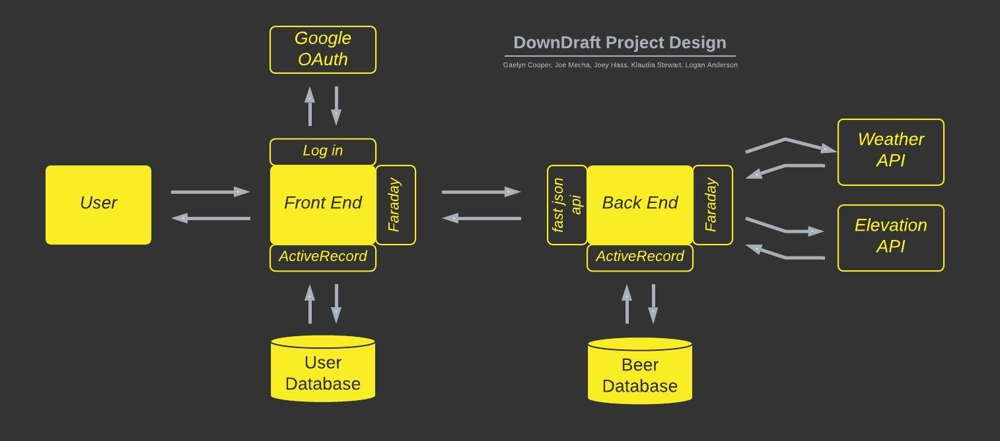
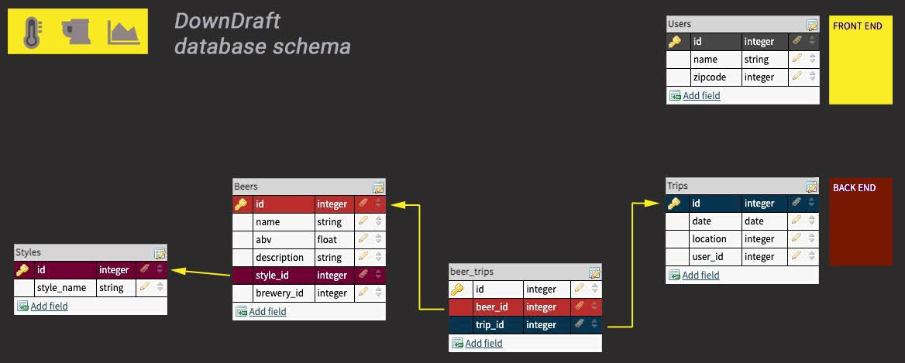

## Table of contents
[**General Info**](#general-info) |
[**Link**](#link) |
[**Screenshot**](#screenshot) |
[**Project Design**](#project-design) |
[**Database Schema**](#database-schema) |
[**Areas of Focus**](#areas-of-focus) |
[**Technologies**](#technologies) |
[**Setup**](#setup) |
[**Features**](#features) |
[**Status**](#status)l |
[**Contact**](contact)

## General info
DownDraft is an application in which users can get beer recommendations based on the forecast (temperature) and elevation of a planned outing.

### Backend Application Features:
  * Facade and Service design pattern
  * Serializers to format responses
  * Consumes two public APIs and exposes endpoints for weather forecast, elevation for the Frontend application
  * Imports CSV data to seed database with beer data
  * ActiveRecord methods to source beer recommendations based on requests from the Frontend application
  

 
## Link
### [https://down-draft.herokuapp.com/](https://down-draft.herokuapp.com/)

## Screenshot
### ![Demo]lib/images/down-draft-demo.gif)

## Project Design

## Database Schema

## Areas of Focus
* Practice good project management through project boards, wireframes, daily stand-ups and rotating pairs
* Make small commits, descriptive pull requests with template, team code reviews
* Writing clean, maintainable code

## Technologies
Project is created with:
* Ruby version 2.5.3
* Rails version 5.2.5

## Setup
To run this program:

1. Open the browser of your choice and navigate to:
[https://down-draft.herokuapp.com/](https://down-draft.herokuapp.com/)
2. Register as a new user with your Google account
3. Enter a default zipcode
4. Create a trip to get beer recommendations

   ## Local Setup

   1. Fork and Clone the repo
   2. Install gem packages: `bundle install`
   3. Setup the database: `rails db:{create,migrate}`
   4. Add beer data to the database: `rails csv_load:all`

## To-do list:
* Complete API endpoints
* Refactoring
* Additional extensions

## Status
Project is: _in progress_

## Contact
Created by
* Logan Anderson [GitHub](https://github.com/loganjacob76) • [LinkedIn](https://www.linkedin.com/in/logan-anderson-01b49920a/)
* Gaelyn Cooper [GitHub](https://github.com/gaelyn) • [LinkedIn](https://www.linkedin.com/in/gaelyn-cooper/)
* Joey Hass [GitHub](https://github.com/joeyh92989) • [LinkedIn](https://www.linkedin.com/in/haasjoseph/)
* Joe Mecha [GitHub](https://github.com/joemecha) • [LinkedIn](https://www.linkedin.com/in/joemecha/)
* Klaudia Stewart [GitHub](https://github.com/klaudiastewart) • [LinkedIn](https://www.linkedin.com/in/klaudia-stewart/)

~ feel free to contact us ~

<!--  -->
